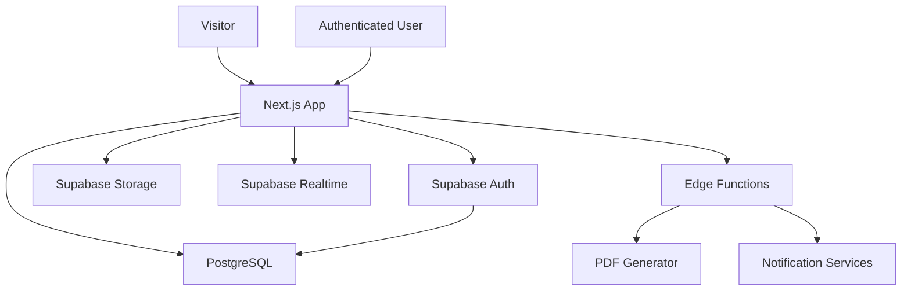

# Software Design Document

## 1. Architecture Overview

UAP menggunakan arsitektur modular dengan Next.js sebagai frontend dan Supabase Self-Hosted sebagai backend utama.

## 2. Application Layers

| Layer | Responsibility |
| --- | --- |
| App Router | Routing, layouts, role dashboard, public website |
| UI Components | Shared UI primitives and feature components |
| Server Actions/API Routes | Secure mutations, validation, integration boundary |
| Supabase Client | Auth, data access, storage access |
| PostgreSQL | Source of truth |
| Storage | User files, reports, certificates, images, attachments |
| Edge Functions | PDF generation, notification, scheduled jobs |

## 3. Module Boundaries

| Module | Boundary |
| --- | --- |
| Website | Public pages and content rendering |
| CMS | Content authoring and publication workflow |
| LKP | Program, curriculum, batch, class, schedule |
| Internship | Candidate and participant lifecycle |
| LMS | Course, lesson, quiz, assignment, progress |
| Task | Board, list, card, checklist, comments, attachments |
| Attendance | Check-in, check-out, geolocation, validation |
| Daily Report | Report submission, mentor approval, revision |
| School Portal | Read-focused monitoring for school users |
| Assessment | Score, finalization, certificate generation |

## 4. Auth and RBAC

Authentication uses Supabase Auth. Application authorization uses database-backed RBAC:

- `roles`
- `permissions`
- `role_permissions`
- `user_profiles`
- `user_roles`

Row Level Security should be enabled for sensitive tables. Policies must be based on role, ownership, school relation, mentor relation, and admin scope.

## 5. Storage Buckets

| Bucket | Usage |
| --- | --- |
| avatars | User avatars |
| daily-report | Daily report attachments |
| task | Task card attachments |
| certificate | Generated certificates |
| learning | LMS files and videos |
| gallery | Public gallery images |
| article | Article images |
| mentor | Mentor profile images |
| school-logo | School logos |

## 6. Status Model

Important workflows should use explicit status values:

- Application: `draft`, `submitted`, `reviewed`, `accepted`, `rejected`, `cancelled`
- Internship: `pending`, `active`, `paused`, `completed`, `failed`, `alumni`
- Daily report: `submitted`, `approved`, `revision_requested`
- Attendance: `pending`, `valid`, `invalid`, `manual_review`
- Assessment: `draft`, `submitted`, `finalized`
- Certificate: `pending`, `generated`, `signed`, `issued`, `revoked`

## 7. Audit Log

Audit log records should include:

- actor user id
- action
- resource type
- resource id
- previous value
- next value
- metadata
- timestamp

