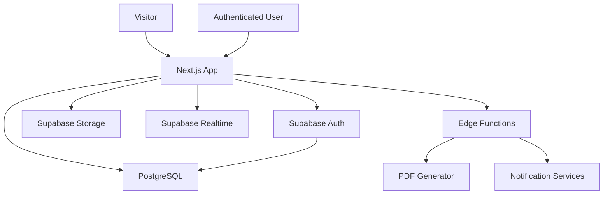

# Dokumen Desain Software

## 1. Gambaran Arsitektur

UAP menggunakan arsitektur modular dengan Next.js sebagai frontend dan Supabase Self-Hosted sebagai backend utama.

## 2. Lapisan Aplikasi

| Layer | Tanggung Jawab |
| --- | --- |
| App Router | Routing, layout, dashboard berbasis role, dan website publik |
| UI Components | Komponen UI bersama dan komponen fitur |
| Server Actions/API Routes | Mutasi data yang aman, validasi, dan batas integrasi |
| Supabase Client | Auth, akses data, dan akses storage |
| PostgreSQL | Sumber data utama |
| Storage | File user, laporan, sertifikat, gambar, dan lampiran |
| Edge Functions | Generate PDF, notifikasi, dan job terjadwal |

## 3. Batas Modul

| Modul | Batas Tanggung Jawab |
| --- | --- |
| Website | Halaman publik dan rendering konten |
| CMS | Penulisan konten dan workflow publikasi |
| LKP | Program, kurikulum, batch, kelas, dan jadwal |
| Internship | Lifecycle calon peserta dan peserta |
| LMS | Course, lesson, quiz, assignment, dan progress |
| Task | Board, list, card, checklist, komentar, dan lampiran |
| Attendance | Check-in, check-out, geolocation, dan validasi |
| Daily Report | Submit laporan, approval mentor, dan revisi |
| School Portal | Monitoring berbasis akses baca untuk sekolah |
| Assessment | Nilai, finalisasi, dan generate sertifikat |

## 4. Auth dan RBAC

Authentication menggunakan Supabase Auth. Authorization aplikasi menggunakan RBAC berbasis database di schema `utero_academy`:

- `roles`
- `permissions`
- `role_permissions`
- `user_profiles`
- `user_roles`

Row Level Security perlu aktif untuk tabel sensitif. Policy harus berbasis role, kepemilikan data, relasi sekolah, relasi mentor, dan scope admin.

## 5. Storage Bucket

| Bucket | Penggunaan |
| --- | --- |
| avatars | Avatar user |
| daily-report | Lampiran daily report |
| task | Lampiran task card |
| certificate | Sertifikat yang digenerate |
| learning | File dan video LMS |
| gallery | Gambar gallery publik |
| article | Gambar artikel |
| mentor | Gambar profil mentor |
| school-logo | Logo sekolah |

## 6. Model Status

Workflow penting harus menggunakan status eksplisit:

- Application: `draft`, `submitted`, `reviewed`, `accepted`, `rejected`, `cancelled`
- Internship: `pending`, `active`, `paused`, `completed`, `failed`, `alumni`
- Daily report: `submitted`, `approved`, `revision_requested`
- Attendance: `pending`, `valid`, `invalid`, `manual_review`
- Assessment: `draft`, `submitted`, `finalized`
- Certificate: `pending`, `generated`, `signed`, `issued`, `revoked`

## 7. Audit Log

Record audit log harus berisi:

- id user aktor
- action
- resource type
- resource id
- nilai sebelumnya
- nilai terbaru
- metadata
- timestamp
