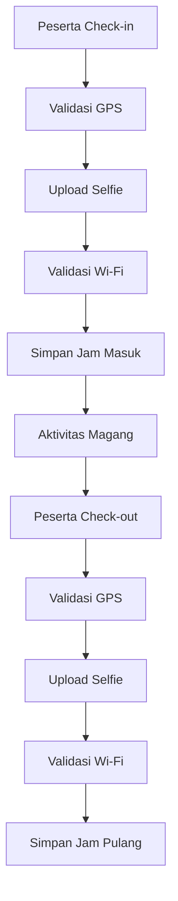
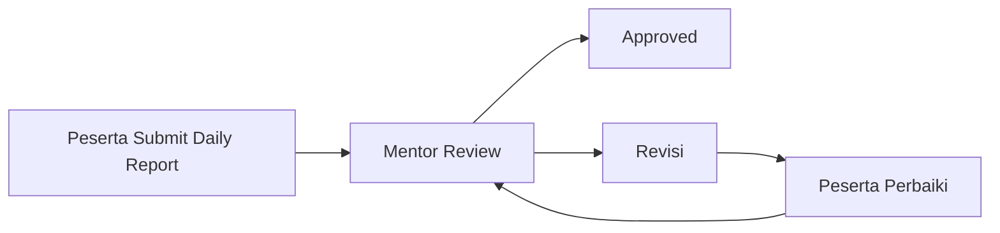
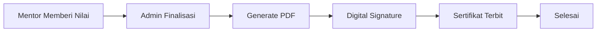

# Business Process

## Internship Lifecycle

```mermaid
flowchart LR
    Register["Pendaftaran"]
    Selection["Seleksi"]
    Accepted["Diterima"]
    Mentor["Penempatan Mentor"]
    Start["Mulai Magang"]
    Monitoring["Monitoring"]
    Assessment["Penilaian"]
    Graduate["Lulus"]
    Alumni["Alumni"]

    Register --> Selection
    Selection --> Accepted
    Accepted --> Mentor
    Mentor --> Start
    Start --> Monitoring
    Monitoring --> Assessment
    Assessment --> Graduate
    Graduate --> Alumni
```

## Daily Attendance

```mermaid
flowchart TB
    InStart["Peserta Check-in"]
    InGPS["Validasi GPS"]
    InSelfie["Upload Selfie"]
    InWifi["Validasi Wi-Fi"]
    InSaved["Simpan Jam Masuk"]
    Work["Aktivitas Magang"]
    OutStart["Peserta Check-out"]
    OutGPS["Validasi GPS"]
    OutSelfie["Upload Selfie"]
    OutWifi["Validasi Wi-Fi"]
    OutSaved["Simpan Jam Pulang"]

    InStart --> InGPS --> InSelfie --> InWifi --> InSaved --> Work
    Work --> OutStart --> OutGPS --> OutSelfie --> OutWifi --> OutSaved
```

## Daily Report Approval

```mermaid
flowchart LR
    Submit["Peserta Submit Daily Report"]
    Review["Mentor Review"]
    Approved["Approved"]
    Revision["Revisi"]
    Resubmit["Peserta Perbaiki"]

    Submit --> Review
    Review --> Approved
    Review --> Revision
    Revision --> Resubmit
    Resubmit --> Review
```

## Assessment and Certificate

```mermaid
flowchart LR
    Score["Mentor Memberi Nilai"]
    Finalize["Admin Finalisasi"]
    Generate["Generate PDF"]
    Sign["Digital Signature"]
    Issue["Sertifikat Terbit"]
    Done["Selesai"]

    Score --> Finalize --> Generate --> Sign --> Issue --> Done
```

