# ERD Database

ERD ini adalah model logis awal. Detail tabel dan kolom perlu disempurnakan sebelum migration final digunakan untuk production.

Semua tabel aplikasi berada di schema `utero_academy`. Tabel user Supabase tetap berada di schema bawaan `auth`.

```mermaid
erDiagram
    users ||--|| user_profiles : has
    users ||--o{ user_roles : has
    roles ||--o{ user_roles : assigned
    roles ||--o{ role_permissions : has
    permissions ||--o{ role_permissions : included

    schools ||--o{ school_contacts : has
    schools ||--o{ intern_profiles : sends
    users ||--o| mentor_profiles : may_be
    users ||--o| intern_profiles : may_be

    programs ||--o{ curriculums : has
    programs ||--o{ batches : has
    batches ||--o{ classes : has
    classes ||--o{ class_enrollments : has
    intern_profiles ||--o{ class_enrollments : joins

    internship_applications ||--o| intern_profiles : creates
    mentor_profiles ||--o{ mentor_assignments : supervises
    intern_profiles ||--o{ mentor_assignments : assigned

    courses ||--o{ lessons : has
    courses ||--o{ course_enrollments : has
    intern_profiles ||--o{ course_enrollments : enrolls
    lessons ||--o{ lesson_progress : tracks
    intern_profiles ||--o{ lesson_progress : completes
    courses ||--o{ quizzes : has
    quizzes ||--o{ quiz_attempts : records
    intern_profiles ||--o{ quiz_attempts : submits
    courses ||--o{ assignments : has
    assignments ||--o{ assignment_submissions : receives
    intern_profiles ||--o{ assignment_submissions : submits

    task_boards ||--o{ task_lists : has
    task_lists ||--o{ task_cards : has
    task_cards ||--o{ task_checklists : has
    task_cards ||--o{ task_comments : has
    task_cards ||--o{ task_attachments : has
    intern_profiles ||--o{ task_cards : assigned
    mentor_profiles ||--o{ task_cards : supervises

    intern_profiles ||--o{ attendances : submits
    intern_profiles ||--o{ daily_reports : submits
    daily_reports ||--o{ daily_report_attachments : has
    mentor_profiles ||--o{ daily_report_reviews : reviews
    daily_reports ||--o{ daily_report_reviews : receives

    intern_profiles ||--o{ assessments : receives
    mentor_profiles ||--o{ assessments : scores
    assessments ||--o| certificates : generates

    cms_sites ||--o{ cms_pages : has
    cms_sites ||--o{ cms_navigation_items : has
    cms_pages ||--o{ cms_sections : has
    cms_sites ||--o{ articles : publishes
    article_categories ||--o{ articles : categorizes
    cms_sites ||--o{ faqs : has
    cms_sites ||--o{ testimonials : has
    cms_sites ||--o{ galleries : has

    users ||--o{ audit_logs : acts
```

## Kelompok Tabel

### Identity

- `users`
- `user_profiles`
- `roles`
- `permissions`
- `user_roles`
- `role_permissions`

### Organisasi

- `schools`
- `school_contacts`
- `mentor_profiles`
- `intern_profiles`

### CMS

- `cms_sites`
- `cms_pages`
- `cms_sections`
- `cms_navigation_items`
- `articles`
- `article_categories`
- `faqs`
- `testimonials`
- `galleries`

### LKP dan Internship

- `programs`
- `curriculums`
- `batches`
- `classes`
- `class_enrollments`
- `internship_applications`
- `mentor_assignments`

### LMS

- `courses`
- `lessons`
- `course_enrollments`
- `lesson_progress`
- `quizzes`
- `quiz_attempts`
- `assignments`
- `assignment_submissions`

### Operasional

- `task_boards`
- `task_lists`
- `task_cards`
- `task_checklists`
- `task_comments`
- `task_attachments`
- `attendances`
- `daily_reports`
- `daily_report_attachments`
- `daily_report_reviews`
- `assessments`
- `certificates`
- `audit_logs`
